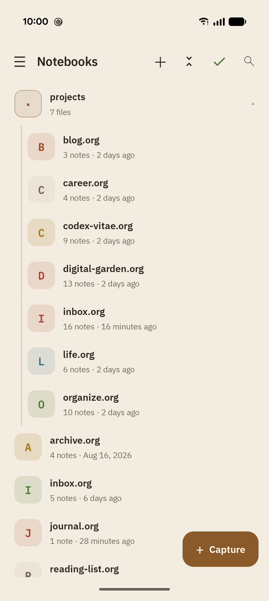
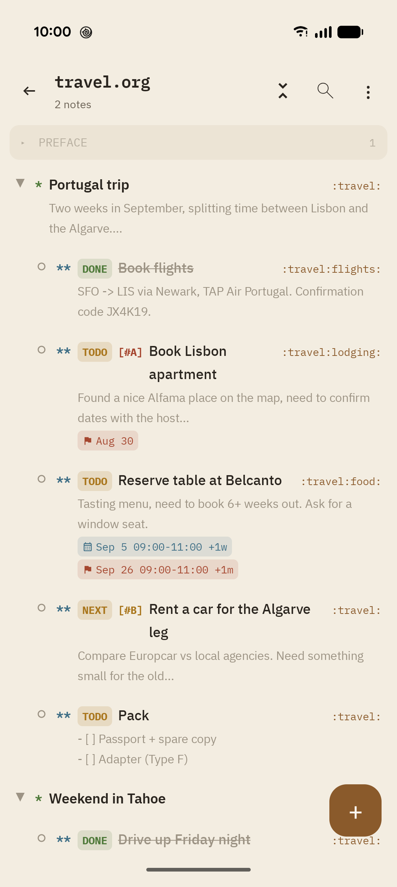
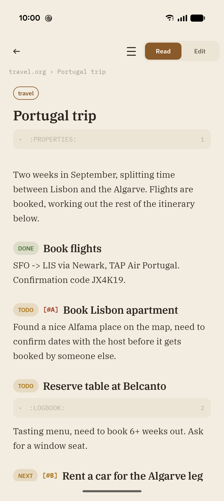
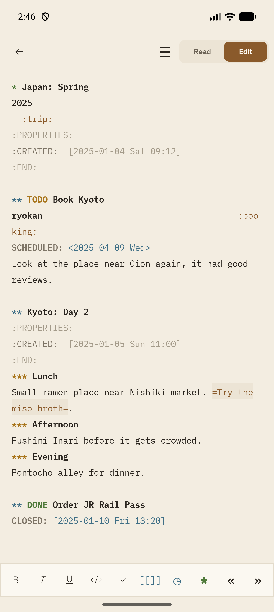
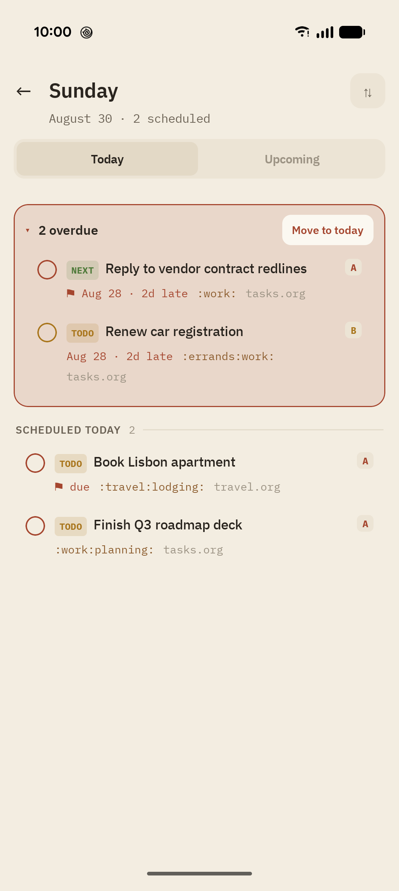
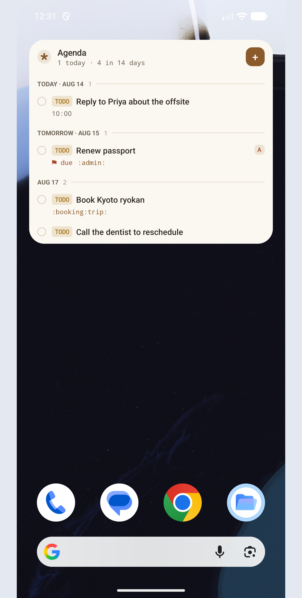

# Grove

**A native Android Org-mode note-taking app: a first-class mobile companion for Emacs org-mode users.**

Grove edits plain `.org` files in a folder you choose. There is no account, no proprietary database, and no export step: the files on disk *are* your notes, byte-for-byte, and they sync to your laptop with whatever tool you already trust (Syncthing is the recommended pairing). If you stop using Grove tomorrow, your notes are exactly where they always were.

<p align="center">
  <a href="https://github.com/rrajath/grove/releases">
    
  </a>
  <a href="https://apps.obtainium.imranr.dev/redirect.html?r=obtainium://add/https://github.com/rrajath/grove">
    
  </a>
</p>

## Highlights

- **File-first**: `.org` files in a synced folder are the sole source of truth. Grove's internal database is only a rebuildable search index.
- **Lossless org engine**: a custom parser models documents as a thin view over the raw text. Parse → serialize is byte-identical by construction, so Grove never reformats a file it didn't deliberately edit.
- **Zero-friction capture**: org-capture style templates with `%U`, `%^{prompt}`, `%cursor`-style placeholders; targets include top/bottom of file, under a heading (by name or `CUSTOM_ID`), and year/month/day datetrees. Reachable from a home-screen widget, the share sheet, an optional persistent notification, and `grove://capture` deep links.
- **Home-screen widgets**: a one-tap Capture widget, and an Agenda ledger widget (overdue + day-grouped upcoming tasks, mark-done and a small quick-add composer right from the home screen — no need to open the app).
- **Real editor**: raw org subtree editing with syntax highlighting, a formatting toolbar, list continuation on Enter, a metadata sheet (TODO state, priority, tags with autocomplete, SCHEDULED/DEADLINE), repeater advancement on DONE, and autosave with a stale-file guard.
- **One canvas for both dates**: scheduling opens a full-screen editor that puts SCHEDULED and DEADLINE on the same calendar (with the lead time between them shaded and a warning if you'd start already late), and commits both in one edit. Each carries presets, a time range and an org repeater, and a shorthand box parses lines like `fri 10-11am ++1w` or `d: aug 5` as you type.
- **Reminders**: a notification fires when a heading's SCHEDULED or DEADLINE time arrives, with Complete (marks the heading done) and Reschedule (reopens the dates screen) actions right on the notification. Enabled by default; notification and exact-alarm access are only requested once the first reminder actually needs scheduling.
- **Outline operations**: collapsible heading tree with body previews, expand/collapse all, move/cut/copy/paste subtrees, cycle state by swipe, narrow to a subtree.
- **Heading-less content is first-class**: text before a file's first heading (or a whole org-roam note with no headings) shows as its own row above the outline, opens in a read view, is counted as a note, and is searchable. Adding metadata to it inserts a blank heading above the content first.
- **Nested vault folders**: subdirectories inside the vault are first-class. The Notebooks screen shows the whole vault as an inline tree (a folder with more than 20 files becomes a tappable drill-down instead), a notebook's identity is its vault-relative path, and `＋` / "Move to folder…" create and relocate notebooks across folders.
- **Orgzly-compatible search**: `i.todo s.7d t.work .b.archive OR p.a`, saved searches, and an `ad.N` agenda view. Backed by a SQLite FTS5 trigram index, so substring search stays instant as the vault grows and covers full note bodies. See [docs/search-syntax.md](docs/search-syntax.md).
- **Sync that respects your tools**: change detection by file revision, Syncthing `.sync-conflict-*` detection with a keep-local / keep-remote / keep-both picker, manual through continuous sync modes, `.orgzlyignore` support.
- **A warm, deliberate design**: IBM Plex Sans/Serif/Mono, an earth-tone palette with full dark mode, and org syntax tokens colored the way an Emacs theme would.

## Screenshots

| Notebooks                                                                           | Outline                                                                         | Read mode                                                                          |
|-------------------------------------------------------------------------------------|---------------------------------------------------------------------------------|------------------------------------------------------------------------------------|
|  |  |  |

| Edit mode                                                                          | Agenda                                                                        | Widget                                                                        |
|------------------------------------------------------------------------------------|-------------------------------------------------------------------------------|-------------------------------------------------------------------------------|
|  |  |  |

## Getting started

### Requirements

- Android 14+ (`minSdk 34`)
- To build: JDK 17+, Android SDK 36. Open in Android Studio, or:

```bash
./gradlew assembleDebug          # build
./gradlew testDebugUnitTest      # unit tests
./gradlew lintDebug              # lint
```

### First run

1. Launch Grove and pick your org folder (any folder reachable through Android's file picker).
2. Point Syncthing (or any other sync tool) at the same folder to share it with your other machines.
3. Capture something.

## Roadmap
Following is the list of features/enhancements I'm planning to make to this app:
- [ ] Clickable org links
- [ ] Image support
- [ ] Nested search expressions
- [ ] WebDAV support
- [x] Tips & Tricks page

## Project layout

```
app/src/main/java/com/rrajath/grove/
├── org/        Org-mode engine: parser, mutations, timestamps, line editing
├── vault/      File access: recursive FileStore abstraction, SAF + JVM impls, Vault facade
├── sync/       Sync engine, state machine, conflict handling, Android triggers
├── data/       Room index (rebuildable cache) over the vault
├── capture/    Capture templates, placeholder expansion, entry insertion
├── search/     Orgzly-style query parser, matcher, snippets, saved searches
├── settings/   Preferences (DataStore) and settings repository
├── widget/     Home-screen widgets (Capture, Agenda ledger) + persistent capture notification
└── ui/         Jetpack Compose screens, view models, theme
```

## Documentation

| Document | What it covers |
|---|---|
| [docs/architecture.md](docs/architecture.md) | Layers, data flow, threading, and the invariants that hold the app together |
| [docs/terminology.md](docs/terminology.md) | Glossary of org-mode and Grove-specific terms used throughout the code |
| [docs/search-syntax.md](docs/search-syntax.md) | Full reference for the search query language |

## Docs site

`docs-site/` is the public landing page and user docs (Astro + Starlight), deployed as a Cloudflare Worker with static assets (`npm run deploy`). It's a separate npm project — see [docs-site/README.md](docs-site/README.md) for setup and deployment details. Changes there don't trigger the app CI workflow (`.github/workflows/build.yml` ignores `docs-site/**`).

## Tech stack

Kotlin 2.2 · Jetpack Compose (Material 3) · Room (on bundled SQLite, for FTS5) · DataStore · WorkManager · Glance · kotlinx.serialization · JUnit 4

## Fonts

Grove bundles IBM Plex Sans, Serif, and Mono, licensed under the SIL Open Font License (see `FONT_LICENSE_OFL.txt`).

## License

This project is licensed under the Apache License 2.0 - see the [LICENSE](https://github.com/rrajath/grove/blob/main/LICENSE) file for details.

## AI Transparency

This app was built with help from LLM-based coding tools (Claude Code). All design decisions, architecture, and every piece of code are reviewed and tested by me. LLMs are a tool in the workflow, not an autopilot.
