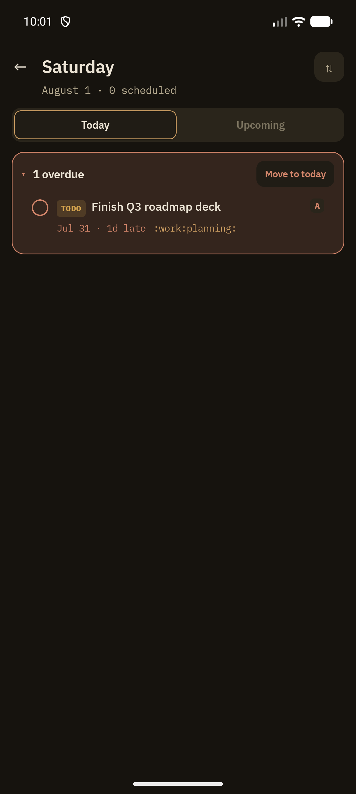

Agenda pulls every SCHEDULED and DEADLINE item across your whole vault into a single day-by-day timeline, separate from browsing notebook-by-notebook.

## Today / Upcoming tabs

- **Today** — everything scheduled or due today, plus an **Overdue** card for anything past its date
- **Upcoming** — an infinite-scroll timeline of future days, grouped under day headers like "Tuesday, Jul 28 · Today"

## Overdue card

Collapsible by default; expanding it lists every overdue item with a **Move to today** bulk action to reschedule everything at once.

## Row anatomy

Each row shows a priority-tinted checkbox (tap to mark done), the TODO/keyword chip, the title, a metadata line (date, "Xd late" for overdue items, tags), and a priority badge on the trailing edge. Tapping the row opens the note; tapping the checkbox toggles DONE in place.

## Levers panel

A collapsible panel above the list controls how items are grouped and filtered, and persists your choice between sessions:

- **Group by** — Date, Priority, Tag, or File
- **Show** — Open items only, specific configured keywords, or Everything
- **Display toggles** — show/hide tags and source-file names per row

## Swipe-to-commit

Swiping an Agenda row left or right triggers a configurable action — by default, swipe left sets a Scheduled date and swipe right marks the item Done. Both directions are reconfigurable in Settings → Agenda (see [Notes Behavior](/features/notes-behavior) for the settings surface). Every swipe mutation is reversible via an [undo snackbar](/features/undo).

## Related

- [Search](/features/search) — the query-driven counterpart, also date-aware via `s.`/`d.` facets
- [Planning Dates](/features/planning-dates) — how SCHEDULED/DEADLINE values get set in the first place
- [Reminders](/features/reminders) — notifications for the same dates Agenda surfaces
