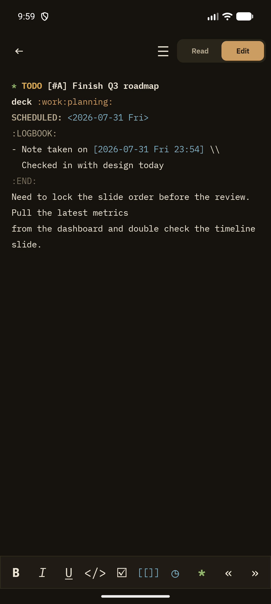

Edit mode shows the note's subtree as plain org-mode text — stars, TODO keywords, timestamps, tags, drawers, all visible and directly editable, with live syntax highlighting layered on top for readability.

## Syntax highlighting

Grove tokenizes each line and applies color per syntax element as you type:

- Heading stars (`*`, `**`, `***`) — colored by nesting depth, cycling through the same star-color sequence used in Outline View
- TODO/DONE keywords
- Timestamps (`<...>`, `[...]`)
- Tags (`:work:planning:`)
- Property-drawer keys and `:LOGBOOK:` contents

This is implemented with a custom `VisualTransformation` over a `BasicTextField` — there's no separate preview pane, the highlighting applies directly to the text you're editing.

## Formatting toolbar

A toolbar pinned above the keyboard gives one-tap access to common org markup:

| Icon | Inserts |
|---|---|
| **B** | `*bold*` |
| *I* | `/italic/` |
| U | `_underline_` |
| `</>` | `=code=` |
| ☑ | `- [ ]` checkbox item |
| `[[ ]]` | link brackets |
| 🕐 | timestamp — tap for a date, long-press for date+time |
| `*` | new heading |
| `«` `»` | list indent/outdent |

## Instant Read ↔ Edit switching

The **Read / Edit** toggle at the top swaps modes in place — no navigation transition, no extra back-stack entry. Switching to Read mode also triggers a save if there are unsaved changes.

## Autosave

Edit mode saves automatically:

- After roughly 5 seconds of idle typing
- Immediately when you switch to Read mode
- The save indicator (a floppy-disk icon) shows **green** for unsaved changes — tap it to save immediately — and **grey** once saved; tapping the grey icon shows a "last saved at" toast

## Stale-file protection

Before saving, Grove checks the file's on-disk revision. If something else changed the file since you opened it (another device via sync, an external editor), you're prompted to **Overwrite** or **Reload** rather than silently clobbering the other change.

## Discarding a blank note

If you open a brand-new, still-empty note and try to leave without adding content, Grove asks for confirmation before discarding it — so an accidental capture doesn't quietly vanish, but an accidental tap also doesn't leave an empty heading behind.

## Related

- [Read Mode](/features/read-mode) — the rendered counterpart
- [Metadata Sheet](/features/metadata-sheet) — editing state/priority/tags/dates without touching raw text
- [Capture](/features/capture) — this same editor, formatting toolbar included, used for quick capture
