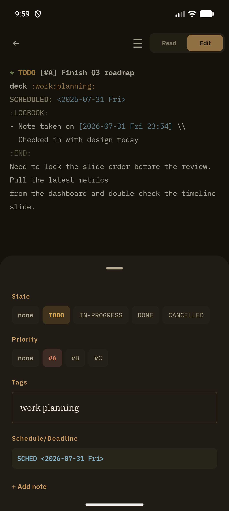

The metadata sheet is a structured, tap-driven alternative to hand-editing a heading's org syntax. Open it from the ☰ icon in the top bar of [Read](/features/read-mode) or [Edit](/features/edit-mode) mode.

## Sections

- **State** — tap any configured TODO keyword (none, TODO, IN-PROGRESS, DONE, KILL, or your own custom set from Settings → Notes) to cycle the heading's state
- **Priority** — none, `#A`, `#B`, `#C`
- **Tags** — free-text field, space-separated; suggestion chips surface tags already used elsewhere in your vault as you type
- **Schedule/Deadline** — a single pill summarizing SCHEDULED and DEADLINE together; tap it to open [Planning Dates](/features/planning-dates)

When both a SCHEDULED and a DEADLINE date are set, the pill shows them stacked on two lines (`SCHED ...` above `DUE ...`) rather than crammed onto one, so both stay legible.

## Add note

**+ Add note** opens the same timestamped-note dialog available from Outline View's swipe action — it appends an entry to the heading's `:LOGBOOK:` drawer without leaving the current screen.

## Related

- [Planning Dates](/features/planning-dates) — the full SCHEDULED/DEADLINE editor behind the pill
- [Read Mode](/features/read-mode) / [Edit Mode](/features/edit-mode) — where the ☰ icon lives
- [Notes Behavior](/features/notes-behavior) — configuring custom TODO keyword sets and default priority
