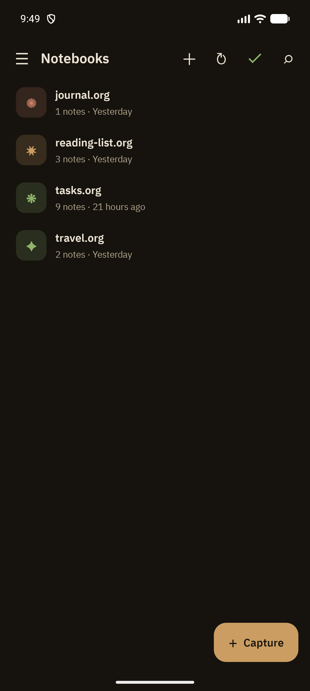
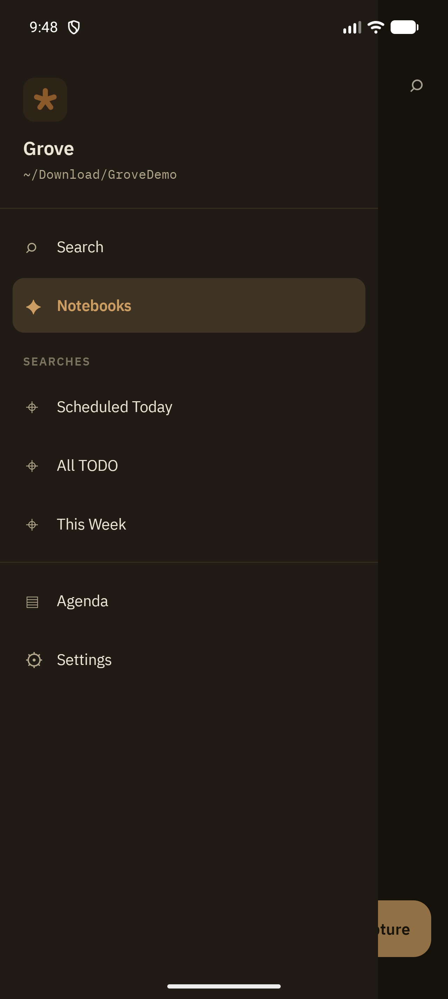

Notebooks is Grove's home screen. Every `.org` file in your configured sync folder shows up here as a notebook card — there's no separate "import" step, no database to seed. If a `.org` file exists in the folder, it's a notebook.

## What each card shows

Every notebook card displays:

- **Icon glyph and color** — a small colored tile with a symbol, customizable per notebook (long-press → *Icon & color*). Hide the tiles list-wide with **Show file icons in notebooks** in Settings → Look and Feel.
- **Notebook name** — the filename by default, or the file's `#+TITLE:` if you've set the notebook display name to "Title" in Settings → Notes
- **Note count and last-modified time** — e.g. "9 notes · 21 hours ago"
- **Sync status pill** — appears when a notebook is mid-sync, freshly modified, or has a conflict

## Top bar actions

| Icon | Action |
|---|---|
| ☰ | Open the navigation drawer |
| + | Create a new notebook |
| ↻ | Force a manual sync/re-index |
| ✓ | Toggle multi-select mode for bulk actions |
| 🔍 | Open Search |

## Long-press menu

Long-pressing a notebook card opens a context menu with:

- **Pin to top** / **Unpin** — keep frequently used notebooks at the top of the list, independent of alphabetical or recency order
- **Rename**
- **Icon & color** — pick the glyph and tint shown on the card
- **Force reload** — re-parse this file from disk, bypassing the normal change-detection diff (useful if you suspect Grove's index is stale)
- **Resolve conflict** — jumps straight to the [conflict resolution](/features/conflict-resolution) screen when a Syncthing conflict copy exists for this file
- **Delete** — see below

### Deleting a notebook is non-destructive

Deleting a notebook doesn't remove the file. Grove renames it to `<name>.org.trash`, so it drops out of the notebook list but stays on disk, fully recoverable with any file browser or your sync tool. There's no in-app "restore from trash" — you get the file back by renaming it back to `.org` outside the app.

## Creating a notebook

Tap **+** and give the new file a name. Grove creates an empty `.org` file in your sync folder immediately.

## Navigation drawer

Tap the hamburger icon (☰) to open the drawer:

The drawer shows:

- **Vault path** — the folder Grove is currently synced to, under the app name
- **Search** — jumps to the [Search](/features/search) screen
- **Notebooks** — the current screen, highlighted
- **Saved Searches** — your starred searches for one-tap access (see [Search](/features/search))
- **Agenda** — jumps to [Agenda](/features/agenda)
- **Settings** — jumps to the [Settings hub](/features/settings-overview)

## Deep links

Grove registers `grove://` deep links so widgets, notifications, and shortcuts can jump straight into the app:

- `grove://note/{id}` — opens a specific note
- `grove://capture` — opens the capture picker
- `grove://agenda` — opens Agenda
- `grove://reminder/...` — used internally by reminder notifications

## Related

- [Outline View](/features/outline-view) — what you see after opening a notebook
- [Sync](/features/sync) — how the sync status pills and re-index behavior work
- [Conflict Resolution](/features/conflict-resolution) — resolving a Syncthing conflict copy
