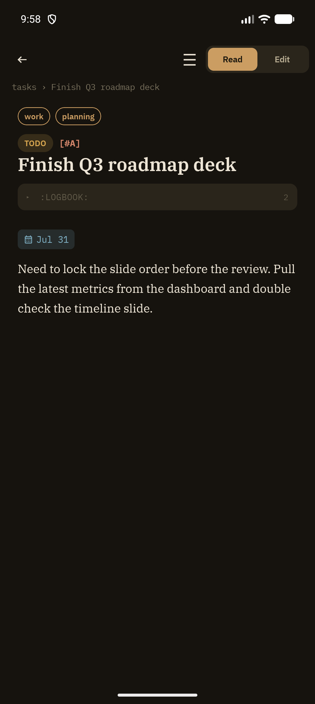

Read mode is the default view when you open a note from [Outline View](/features/outline-view) — a clean, formatted rendering of a heading's subtree, built for reading rather than editing.

## What's rendered

Grove parses the note's org markup and renders it through a custom `AnnotatedString`-based renderer — there is no WebView involved. Supported inline styles:

- **Bold**, *italic*, underline, `code`
- Links (`[[target][description]]`)
- Checklists (`- [ ]` / `- [X]`)
- Planning-date chips — SCHEDULED shown with a calendar icon, DEADLINE with a flag icon
- Tag pills, TODO/keyword chip, and priority tag at the top
- Collapsible drawers (`:LOGBOOK:`, `:PROPERTIES:`) — tap to expand

## Breadcrumbs

Above the title, a breadcrumb trail (`tasks › Finish Q3 roadmap deck`) shows the notebook and heading path. Tapping the notebook name jumps back to Outline View, narrowed to this note's position.

## Top bar

- **← Back** — returns to Outline View
- **☰** — opens the [Metadata bottom sheet](/features/metadata-sheet)
- **Read / Edit** segmented toggle — switches instantly between Read and Edit mode with no navigation transition or backstack entry

## Favoriting

Tap the star in the metadata area (or use the swipe action from Outline View) to favorite a note. Favorited notes appear in the navigation drawer for one-tap access.

## Related

- [Edit Mode](/features/edit-mode) — the raw-text editing counterpart, one tap away
- [Metadata Sheet](/features/metadata-sheet) — state, priority, tags, and scheduling from the ☰ menu
- [Outline View](/features/outline-view) — where you arrive from
