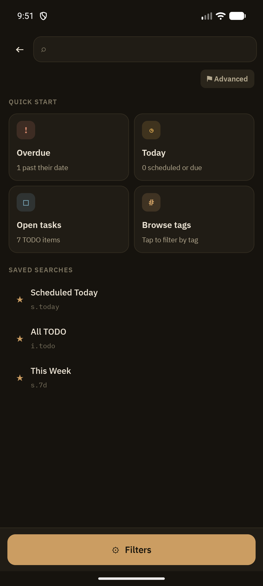
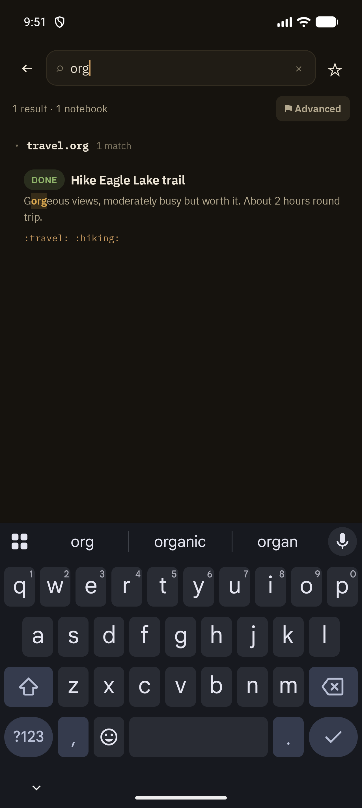
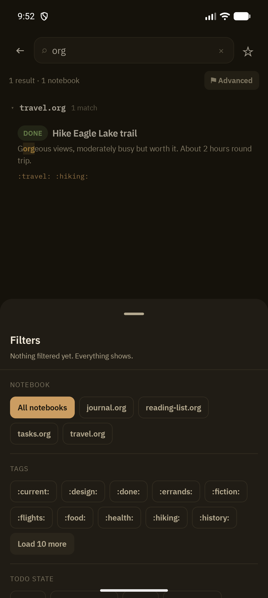

Search covers every notebook in your vault at once, with a compact query syntax borrowed from Orgzly conventions plus a tap-driven filter panel for people who don't want to memorize it.

## Quick start

Opening Search with an empty query shows:

- **Quick Start cards** — Overdue, Today, Open tasks, Browse tags — each a one-tap shortcut into a pre-built query
- **Saved Searches** — your starred queries, each showing its name and underlying query string (e.g. `s.today`)

## Query syntax

Free-text terms combine with `AND`/`OR`/`NOT`, plus facet prefixes:

| Prefix | Matches |
|---|---|
| `i.` | TODO state (`i.todo`, `i.done`) |
| `b.` | notebook |
| `t.` | tag |
| `tn.` | tag, negated |
| `p.` | priority |
| `s.` | scheduled date/range |
| `d.` | deadline date/range |
| `c.` | created date |
| `cr.` | created range |
| `o.` | sort directive |
| `ad.N` | agenda-mode grouping |

As you type, matches highlight inline and results group by notebook under collapsible, sticky-header sections:

## Swipe actions on results

Search results support the same swipe-to-commit gestures as Outline View: swipe left to cycle TODO state via the shared state picker, swipe right to set a Scheduled date via [Planning Dates](/features/planning-dates) — both work across notebooks directly from the results list.

## Filters panel

Tap **Filters** to open a bottom sheet with structured facets — an alternative to typing query syntax by hand:

The panel covers Notebook, Tags, TODO state, Scheduled, Deadline, and Priority, plus a custom date-range picker. Selections compose into the query string, so you can mix typed and tapped filters freely.

## Advanced view

The **Advanced** chip expands an operator-chip breakdown of the current query, useful for checking exactly how a typed expression was parsed before running it.

## Saved searches

Long-press any search (in the drawer or the quick-start list) to **Rename** or **Delete** it. Star a query from the search bar to save it.

## How it's indexed

Results are backed by a SQLite FTS5 full-text index (`RoomNoteIndex`) for speed. Queries that FTS5 can't reliably narrow — short terms, negation, non-ASCII text, date-window arithmetic — fall back to a full scan automatically, so results stay correct even when the index can't help.

## Related

- [Agenda](/features/agenda) — the date-driven counterpart to search
- [Outline View](/features/outline-view) — the swipe-action pattern search results share
