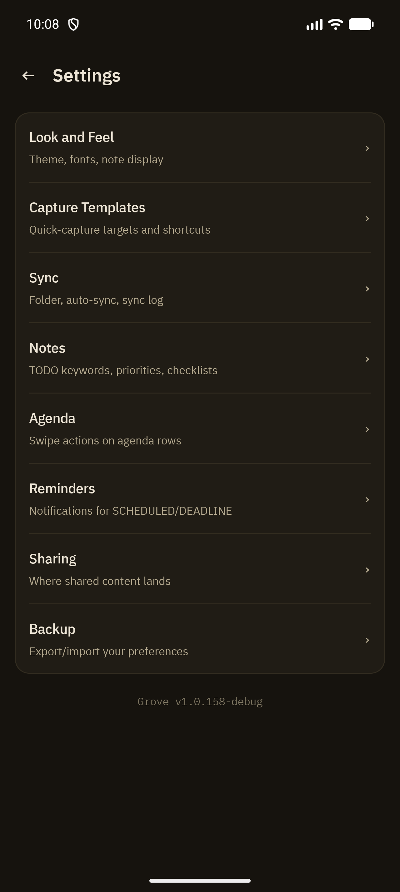

Settings is reachable from the navigation drawer. It's a single hub screen linking out to eight focused sub-pages — each documented in its own page linked below.

## Pages

| Section | Covers | Docs |
|---|---|---|
| **Look and Feel** | Theme, icon-sync, font size, default note mode, preface/property-drawer display | [Themes & Appearance](/features/themes-appearance) |
| **Capture Templates** | Template list, notification toggle | [Capture Templates](/features/capture-templates) |
| **Sync** | Folder picker, auto-sync mode, sync log | [Sync](/features/sync) |
| **Notes** | TODO keywords, priority, checklist states, IDs, auto-archive | [Notes Behavior](/features/notes-behavior) |
| **Agenda** | Swipe-left/swipe-right action bindings | [Agenda](/features/agenda) |
| **Reminders** | Enable toggle, default reminder time | [Reminders](/features/reminders) |
| **Sharing** | Default target file for shared content | [Share Intake](/features/share-intake) |
| **Backup** | Export/import all preferences as JSON | [Backup](/features/backup-export-import) |

The app version is shown at the bottom of the hub screen.

## Keeping settings in sync with backup

Whenever a setting is added anywhere in the app, the [Backup](/features/backup-export-import) export/import logic is expected to cover it too — so a full preference backup never silently misses a newer setting.
