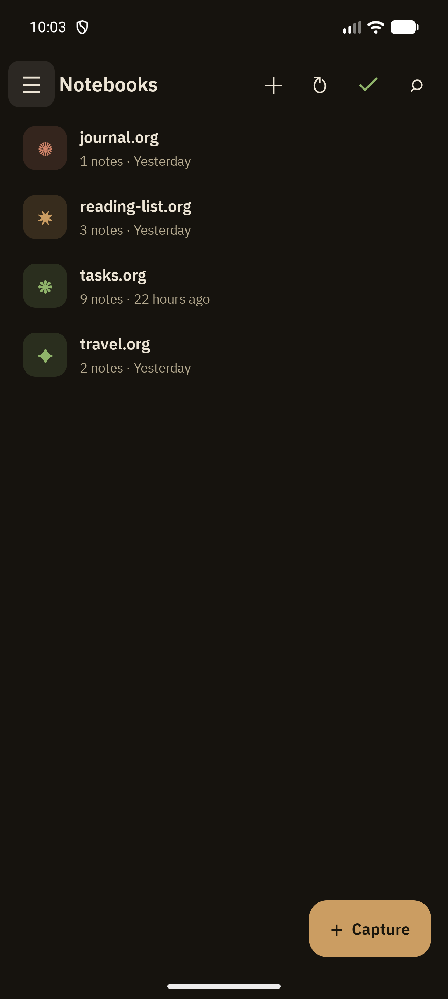

import ThemeShot from '../../../components/ThemeShot.astro';
import capturePickerLight from '../assets/light/capture-picker.png';
import capturePickerDark from '../assets/dark/capture-picker.png';
import captureEditorLight from '../assets/light/capture-editor.png';
import captureEditorDark from '../assets/dark/capture-editor.png';

Capture is Grove's fast path for adding a note without navigating into a notebook first. Pick a template, fill in the blanks (if any), and Grove writes the entry to the right file and location automatically.

## Capture picker

<ThemeShot
  light={capturePickerLight}
  dark={capturePickerDark}
  alt='Capture picker bottom sheet titled "Capture to..." with a Manage link and three template rows, each with a monogram tile: Journal Entry (journal.org · datetree), Quick Note (inbox.org · bottom of file), TODO (tasks.org · bottom of file)'
  widths={[340, 680]}
  sizes="340px"
/>

Each row shows the template name, its target file, and where new entries are inserted (top of file, bottom of file, under a heading, or into a datetree). Tapping a template either opens the capture editor directly, or (if the template has a `%^{prompt}` placeholder) first asks for that input:

**Manage** jumps to [Capture Templates](/features/capture-templates) to add, edit, or reorder templates.

## Capture editor

The editor is pre-filled with the template's expanded content, including any datetree breadcrumb path that was just auto-created:

<ThemeShot
  light={captureEditorLight}
  dark={captureEditorDark}
  alt='Capture editor for "Journal Entry" showing the auto-created datetree breadcrumb journal.org › 2026 › August › Thu 13, a blank heading with an inline timestamp, and the formatting toolbar'
  widths={[340, 680]}
  sizes="340px"
/>

It's the same `BasicTextField` editor and [formatting toolbar](/features/edit-mode) used for regular note editing: bold/italic/underline/code, checkbox and link insertion, timestamp insertion. **Save** splices the finished entry into the template's configured target location; the **×** in the top-left discards it (with a confirmation if you've typed real content).

## Entry points

Capture is reachable from more places than any other Grove screen:

- The **Capture** FAB on the Notebooks screen
- The [home-screen widget](/features/widget)
- The Android **share sheet** (see [Share Intake](/features/share-intake))
- An optional **ongoing notification** (toggle in Settings → Capture Templates)
- The `grove://capture` deep link, including long-press launcher shortcuts

## Related

- [Capture Templates](/features/capture-templates): creating and configuring the templates shown in the picker
- [Placeholders](/features/placeholders): the token syntax templates use to pull in dates, clipboard content, and prompts
- [Share Intake](/features/share-intake): capturing shared URLs and text from other apps
