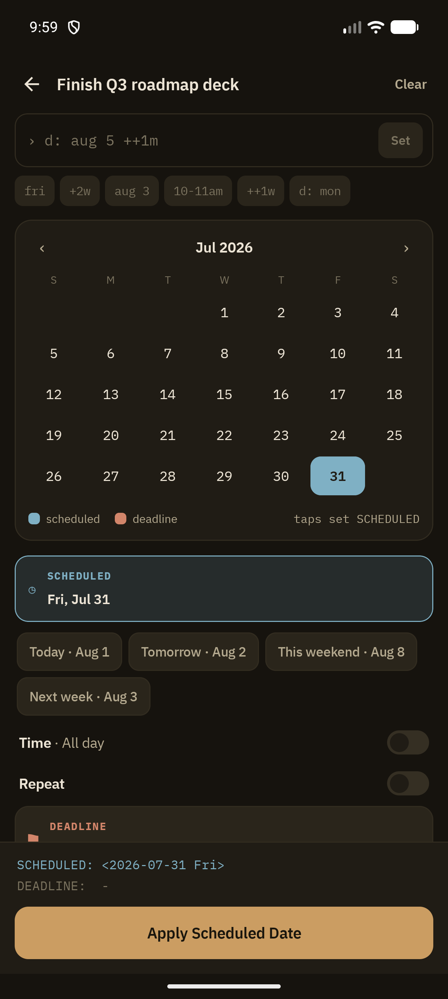

Planning Dates is Grove's full-screen editor for a heading's dates: its SCHEDULED and DEADLINE planning timestamps and its bare active `<date>` event timestamps. It opens from the Dates pill in the [Metadata Sheet](/features/metadata-sheet), from Outline View's Schedule swipe action, from Search's swipe action, and from reminder notifications' Reschedule action.

## Three tabs, one calendar

A segmented control picks which kind the one calendar is editing:

- **SCHEDULED** (`◷`, blue): the day you plan to act. Holds one day.
- **DEADLINE** (`⚑`, red): the day it is due. Holds one day.
- **ACTIVE** (`●`, violet): a plain `<date>` event on the heading. Holds any number of separate event timestamps, plus one date range. Events show on the [Agenda](/features/agenda) on their exact day and never go overdue.

Tapping a day on SCHEDULED or DEADLINE sets that date; tapping it again clears it; tapping a different day moves it. On ACTIVE, each tap toggles a separate event on or off, and a **long-press and drag** sweeps a range (`<2026-09-15 Tue>--<2026-09-18 Fri>` on disk), shown on the calendar as one connected pill. A live `MMM d → MMM d` pill appears by the month header while you drag.

Dates this heading already has on the two tabs you are not editing stay on the calendar as an outlined cell in that kind's colour (blue scheduled, red deadline, violet active), so nothing you set this session disappears when you switch tabs. Days that *other* notes have something on show a small dot (violet), as does today. There is no month swipe: the `‹` / `›` arrows are the only way to change months.

## Shorthand entry

The text field at the top accepts compact shorthand instead of tapping the calendar:

- `s:` targets SCHEDULED, `d:` targets DEADLINE, `a:` targets ACTIVE (it defaults to the current tab)
- Relative tokens like `+2w`, `++1w`, `fri`, `aug 3`, `10-11am`: tapping a quick-token chip inserts it
- **Set** applies the parsed value immediately

## Presets

Below the calendar, one-tap presets for the most common targets: **Today**, **Tomorrow**, **This weekend**, **Next week**, each labeled with the resolved date.

## Time and Repeat

- **Time** toggle switches between all-day and a specific time range. A timed active timestamp fires its own [reminder](/features/reminders); a date-only one is folded into the daily digest.
- **Repeat** toggle exposes the org repeater cookie editor (`+1w`, `++1m`, `.+3d`) for recurring SCHEDULED / DEADLINE tasks

## Preview footer

A raw org-syntax preview sits above the action button, so you see exactly what will be written before committing. **Confirm** applies all three kinds at once; the ACTIVE line is written as the heading's first body line.

## Related

- [Metadata Sheet](/features/metadata-sheet): where the pill that opens this screen lives
- [Agenda](/features/agenda): how SCHEDULED, DEADLINE, and event dates surface in the daily view
- [Reminders](/features/reminders): notifications fired from these dates, and rescheduling directly from a notification
