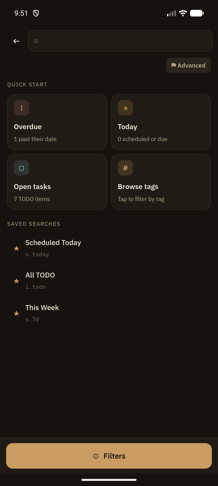
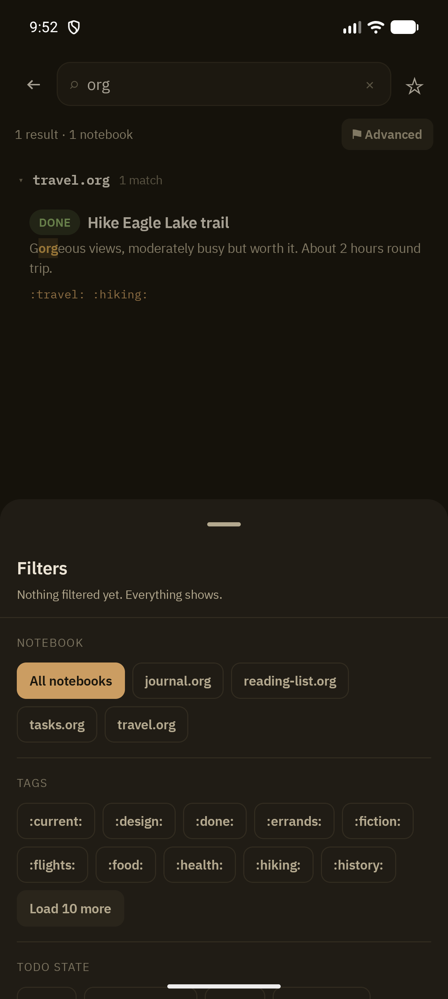

import ThemeShot from '../../../components/ThemeShot.astro';
import searchLight from '../assets/light/search.png';
import searchDark from '../assets/dark/search.png';

Search covers every notebook in your vault at once, with a compact query syntax borrowed from Orgzly conventions plus a tap-driven filter panel for people who don't want to memorize it.

## Quick start

Opening Search with an empty query shows:

- **Quick Start cards**: Overdue, Today, Open tasks, Browse tags, each a one-tap shortcut into a pre-built query
- **Saved Searches**: your starred queries, each showing its name and underlying query string (e.g. `s.today`)

## Query syntax

Terms combine like this:

- A space (or `AND`) means AND: every term must match.
- `OR` means either side can match. It binds looser than AND, so `s.today i.todo OR p.A` reads as `(s.today i.todo) OR p.A`.
- A leading `.` negates a term: `.t.work` excludes anything tagged `work`.
- Brackets group terms and can nest as deep as you need: `i.todo (s.today OR d.today)`.
- `.( … )` negates a whole group: `.(t.work OR t.home)` excludes both tags.
- Double quotes keep spaces, brackets and keywords together: `b."My Notebook"`, `"phone call"`, `"or"`.

`AND` and `OR` work in any case, as in Orgzly. Brackets always group, so to search for one as text, quote it: `"f(x)"`. Unbalanced brackets and quotes are forgiven: a missing `)` or `"` closes at the end of the query, and a stray `)` is ignored.

Facet prefixes:

| Prefix | Matches |
|---|---|
| `i.` | TODO keyword (`i.todo`, `i.next`; `i.none` = no keyword) |
| `it.` | keyword type: `it.todo` (any not-done keyword), `it.done` (any done keyword), `it.none` |
| `b.` | notebook (quote names with spaces) |
| `t.` | tag, including inherited tags |
| `tn.` | tag on the heading itself only |
| `p.` | priority; a heading with no priority counts as your **Default priority** (Settings › Notes) |
| `ps.` | priority written on the heading only |
| `s.` | scheduled date |
| `d.` | deadline date |
| `e.` or `a.` | bare active `<date>` event |
| `c.` | closed date |
| `cr.` | created date |
| `o.` | sort (see below) |
| `ad.N` | agenda view: anything scheduled, due or happening in the N days starting today (overdue included), laid out by day |

### Dates

A date filter is `PREFIX.TIME` or `PREFIX.OP.TIME`. TIME is one day: `today` (or `tod`), `tomorrow` (or `tom`, `tmrw`), `yesterday`, an offset like `3d`, `2w`, `1m`, `1y` (negative counts back: `-1w` is a week ago), or a date like `2026-10-01`. TIME can also be a moment: `now`, or an hour offset like `2h` or `-3h`. OP is one of `eq`, `ne`, `lt`, `le`, `gt`, `ge`.

Without an OP, Grove follows Orgzly's defaults:

| Prefix | Default | So… |
|---|---|---|
| `s.` `d.` `cr.` | `le` (on or before) | `s.today` is scheduled today **or overdue**; `s.3d` is within the next three days or overdue |
| `c.` `e.` `a.` | `eq` (on) | `c.yesterday` is closed yesterday; `e.today` is an event today |

More examples: `s.eq.today` (exactly today), `c.ge.-1w` (closed in the last week), `e.ge.today` (events from today on), `d.gt.1w` (deadline more than a week out).

Against a moment, a timed heading is compared at its time, so `e.ge.now` hides this morning's finished meetings and `d.2h` lists what's due in the next two hours (or overdue). An entry with no time covers its whole day, so today's all-day events and untimed tasks still match `now`.

Two extras take no OP: `overdue` (before today) and `none` (also `no` or `nodate`: no such date at all), e.g. `d.overdue`, `.s.none`.

Searches you saved before this change keep their old meaning: they're rewritten once, so a saved `s.today` becomes `s.eq.today`.

### Sorting

`o.PROP` sorts the results; `.o.PROP` reverses the order. Several sort keys apply in order. Headings without the property always go last.

Without `o.`, a search with words in it ranks the best title matches first. A filters-only search (like `i.todo t.work`) follows Orgzly's order: notebook, then priority, then scheduled or deadline time when the query filters on `s.` or `d.`, then position in the notebook.

| Property | Order by |
|---|---|
| `b` `book` `notebook` | notebook name |
| `t` `title` | title |
| `s` `sched` `scheduled` | scheduled time |
| `d` `dead` `deadline` | deadline time |
| `e` `event` | event time (`o.event` uses a heading's oldest event, `.o.event` its most recent) |
| `c` `close` `closed` | closed time |
| `cr` `created` | created time |
| `p` `pri` `prio` `priority` | priority |
| `st` `state` | TODO keyword, in the order set in Settings |

Putting it together: `b.shopping t.tigros (it.todo OR (it.done c.eq.today)) o.p o.st o.t` lists open items in the shopping notebook tagged `tigros`, plus anything checked off today, sorted by priority, then state, then title.

As you type, matches highlight inline and results group by notebook under collapsible, sticky-header sections (file name on top, folder and match count beneath). A free-text term is also matched against notebook **file names** (the full vault-relative path, so `work` finds `work/planning.org`): a file whose name matches floats above every content-only result as a tappable row that opens its outline, even when nothing inside that file matched the query.

Each result is one of two kinds:

- **Heading**: a heading whose title or own tags contain the search words (as in Orgzly, `phone` also finds a heading tagged `:phone:`), or one picked by a filter such as `i.TODO` or `s.today`. It shows its TODO keyword, priority, title, dates, and tags.
- **Text match**: a line of body text that contains every search word, shown with up to 10 words of context on each side. Words that appear again inside that window stay in the same snippet; matches further apart get their own. Tapping one opens the heading it sits under (or the whole file, for text before the first heading).

A file that matches only through a file-level setting, such as a `#+filetags:` tag, shows a single file row instead of its text.

<ThemeShot
  light={searchLight}
  dark={searchDark}
  alt='Search results for "ramen" showing 2 results grouped under recipes.org and travel.org, with the match highlighted inline in each'
  widths={[340, 680]}
  sizes="340px"
/>

## Swipe actions on results

Heading results have swipe actions (text matches don't, since only a heading can hold a TODO state or a date). They work across notebooks directly from the results list.

- **Swipe left to right**: a long swipe marks an open task **Done** (with Undo). A shorter swipe opens the row with **Done** and **State**, which cycles the TODO state through the shared state picker. On a heading with nothing to complete (no TODO keyword, or already done), the swipe goes straight to the state picker.
- **Swipe right to left**: a long swipe sets a Scheduled date via [Planning Dates](/features/planning-dates). A shorter swipe opens the row with **Reveal** and **Schedule** (Schedule at the edge). **Reveal** opens the heading's notebook in Outline View, unfolded and scrolled to that heading, with a brief highlight.

A long swipe has to travel most of the row's width. As it does, the inner cell fades out and the row's background fills with the color of the action it will commit (green for Done, blue for Schedule), turning solid once releasing would fire it.

Date pills show the time when the heading has one: a task scheduled for 11 PM today reads `today 23:00`.

## Agenda view (`ad.N`)

Add `ad.N` to any search to see the results by day, like Orgzly's agenda: `ad.7 t.work` lists everything tagged `work` that is scheduled, due or happening in the next seven days (today included). An **Overdue** section comes first, then one section per day with something on it. Timed entries are listed in time order, with untimed ones after them. Events (bare active timestamps) appear on every day they cover. The rest of the query still applies, so you can combine `ad.N` with tags, notebooks, states and `OR`.

## Filters panel

Tap **Filters** to open a bottom sheet with structured facets, an alternative to typing query syntax by hand:

The panel covers Notebook, Tags, TODO state, Scheduled, Deadline, and Priority, plus a custom date-range picker. Selections compose into the query string, so you can mix typed and tapped filters freely.

## Advanced view

The **Advanced** chip expands an operator-chip breakdown of the current query, useful for checking exactly how a typed expression was parsed before running it.

## Saved searches

Long-press any search (in the drawer or the quick-start list) to **Rename** or **Delete** it. Star a query from the search bar to save it.

## How it's indexed

Results are backed by a SQLite FTS5 full-text index (`RoomNoteIndex`) for speed. Queries that FTS5 can't reliably narrow (short terms, negation, non-ASCII text, date-window arithmetic) fall back to a full scan automatically, so results stay correct even when the index can't help.

File-name matching is a separate, lightweight pass over the vault's file list that the search screen already keeps in memory; it never changes how note content is matched.

## Related

- [Agenda](/features/agenda): the date-driven counterpart to search
- [Outline View](/features/outline-view): the swipe-action pattern search results share
